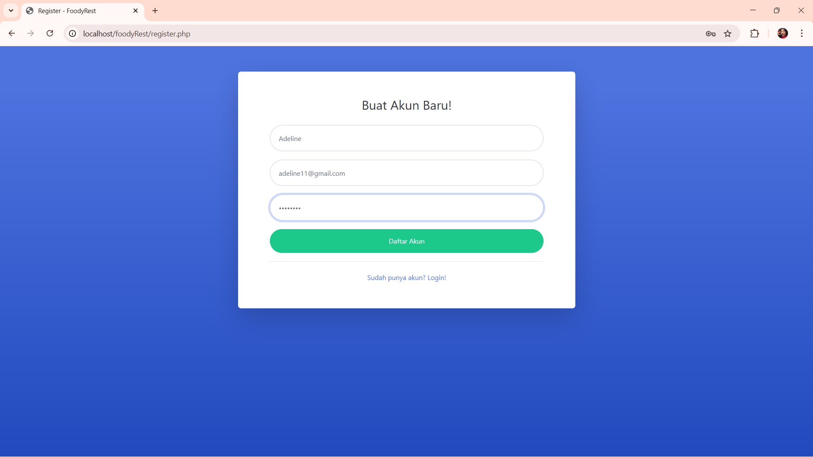
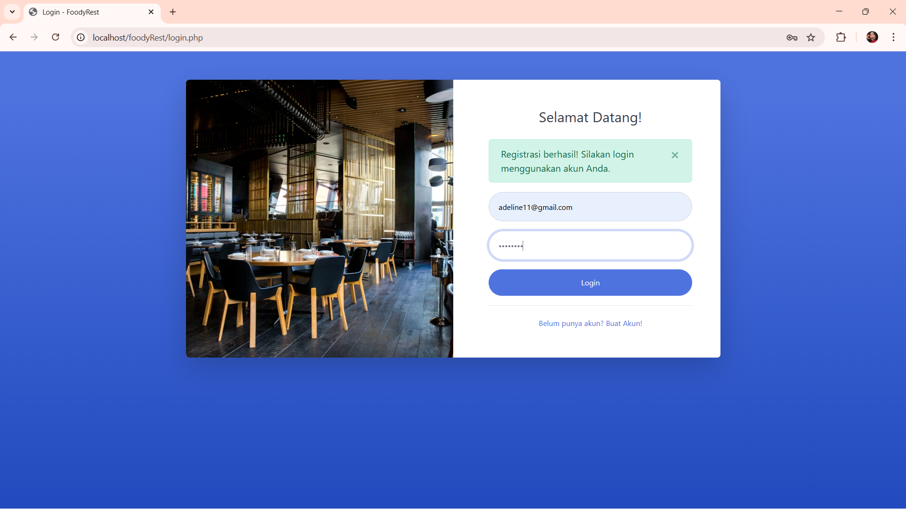
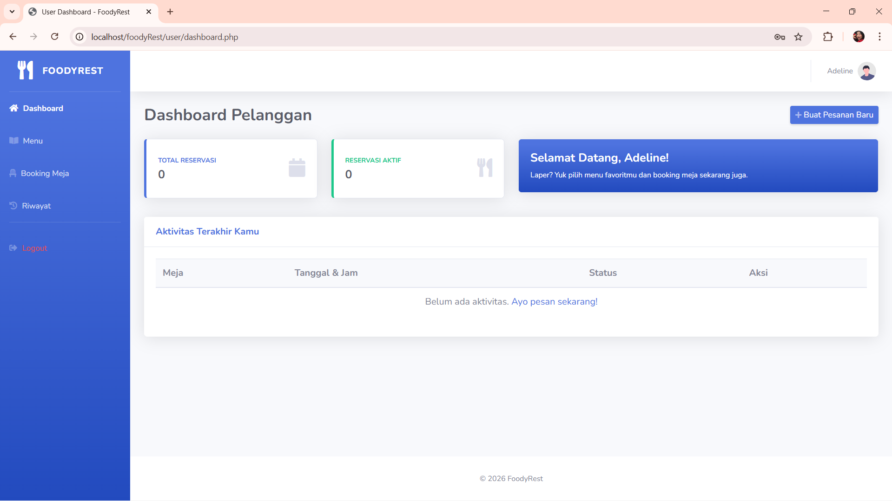
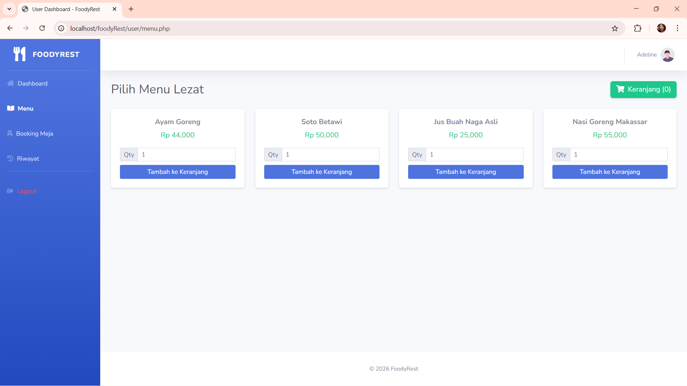
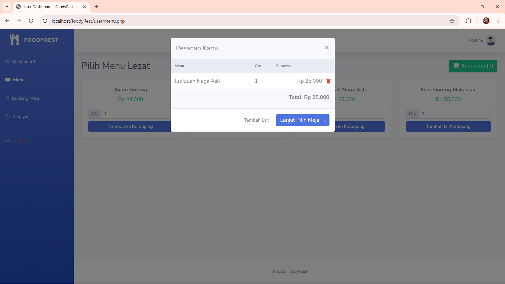
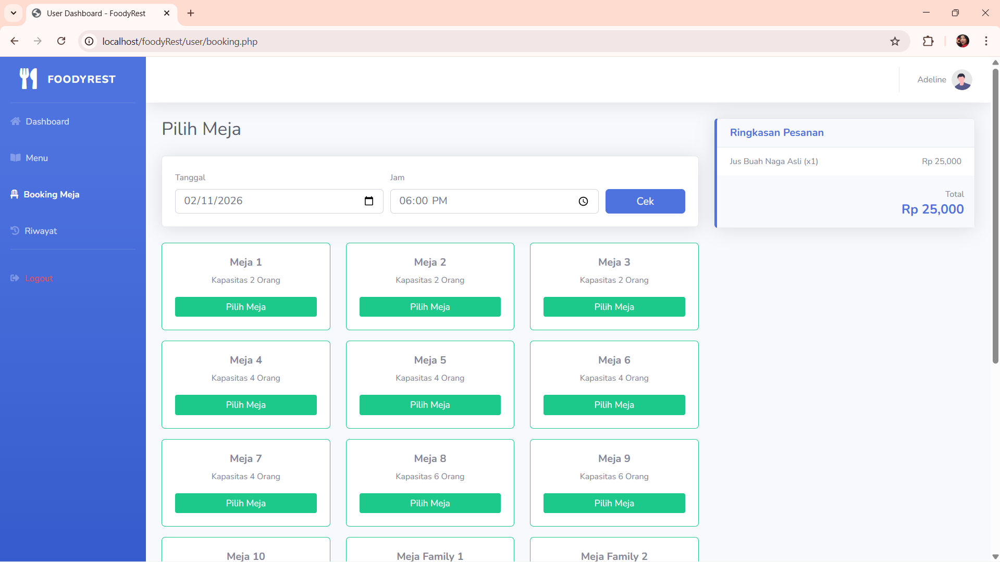
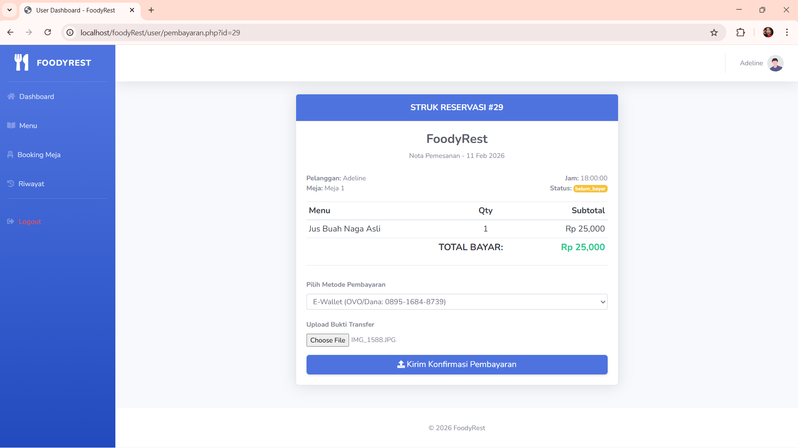
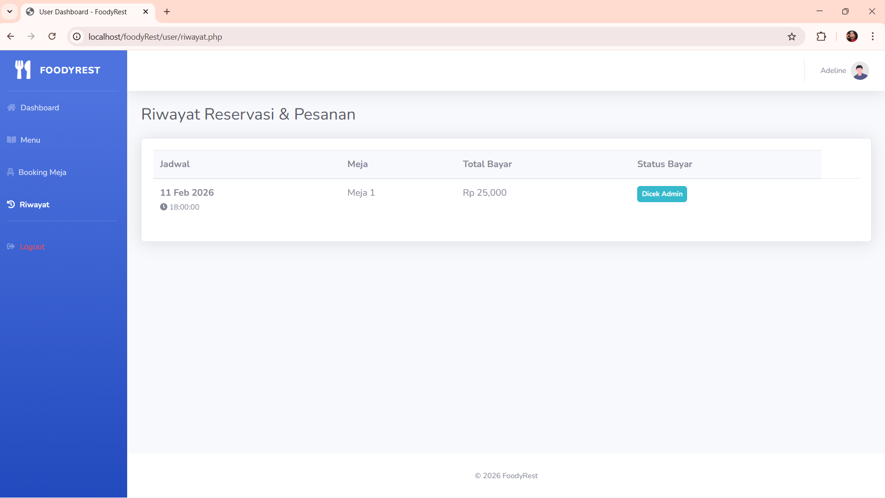

# 🍽 FoodyRest - Restaurant Booking & Ordering System

FoodyRest adalah aplikasi berbasis web untuk reservasi meja restoran dan pemesanan menu secara online dengan sistem pembayaran dan validasi admin.

---

## 🚀 Fitur Utama

### 👤 User
- Registrasi & Login
- Booking meja berdasarkan tanggal & jam
- Pilih menu makanan/minuman
- Keranjang belanja (cart)
- Checkout reservasi + pesanan
- Upload bukti pembayaran
- Melihat riwayat transaksi

### 🛠 Admin
- Login Admin
    [email: foodyAdmin@gmail.com]
    [password: foodyRest01]
- Kelola meja (Tambah, Edit, Hapus)
- Kelola menu
- Kelola metode pembayaran
- Validasi pembayaran (Terima / Tolak)
- Dashboard statistik

---

## 🗄 Struktur Database

Database: `restoran_booking`

Tabel utama:
- cart
- users
- meja
- menu
- reservasi
- transaksi
- transaksi_detail
- pembayaran
- metode_pembayaran

---

## 💳 Sistem Pembayaran

User dapat memilih:
- Transfer Bank (BCA)
- E-Wallet (OVO/Dana)

Admin melakukan konfirmasi pembayaran sebelum status menjadi **Lunas**.

---

## 🖼 Screenshot Aplikasi

### 🔹 Halaman Register

### 🔹 Halaman Login

### 🔹 Dashboard User

### 🔹 Halaman Menu

### 🔹 Halaman Cart

### 🔹 Halaman Booking Meja

### 🔹 Halaman Pembayaran

### 🔹 Halaman Riwayat Pemesanan

---

## ⚙️ Cara Instalasi

1. Clone repository:
git clone https://github.com/AdelinaZivanna/foodyRest-booking.git

2. Import database:
- Buka phpMyAdmin
- Import file `restoran_booking.sql`

3. Konfigurasi koneksi database di:
inc/functions/config.php

4. Jalankan di:
http://localhost/foodyRest/login.php [Login]
http://localhost/foodyRest/register.php [Register]

---

## 🛠 Teknologi yang Digunakan

- PHP Native
- MySQL
- Bootstrap 5 (Template SBAdmin)
- PDO (Database Connection)

---

## 👨‍💻 Developer

Nama: Adelina Zivanna Dopael Pakpahan 
Project: Tugas Akhir PKL

---

## 📌 Catatan

Project ini dibuat untuk tujuan pembelajaran dan pengembangan sistem reservasi restoran berbasis web.

